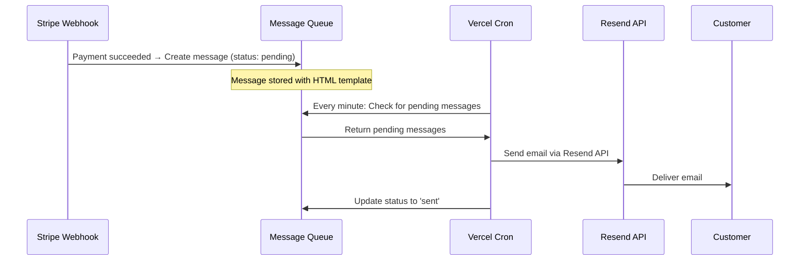

# Message Queue Automatic Processing Setup

## Overview

The message queue automatically processes pending messages every minute using Vercel Cron Jobs. This ensures that all transactional emails (order confirmations, commission notifications, etc.) are sent promptly without manual intervention.

## How It Works

1. **Message Creation**: When events occur (orders, signups, commissions), messages are added to the `message_queue` table with status `pending`
2. **Automatic Processing**: Vercel Cron calls `/api/messaging/process` every minute
3. **Email Delivery**: The processor picks up pending messages and sends them via Resend
4. **Status Updates**: Messages are marked as `sent` or `failed` with retry logic

## Vercel Cron Configuration

The cron job is configured in `vercel.json`:

```json
{
  "crons": [
    {
      "path": "/api/messaging/process",
      "schedule": "* * * * *"
    }
  ]
}
```

**Schedule**: `* * * * *` means every minute

## Environment Variables Required

Add these to your Vercel project:

```bash
# Resend API Key (required for email sending)
RESEND_API_KEY=re_xxxxxxxxxxxxx

# Cron Secret (optional - for additional security)
CRON_SECRET=your-random-secret-key

# Twilio (optional - for SMS)
TWILIO_ACCOUNT_SID=xxxxx
TWILIO_AUTH_TOKEN=xxxxx
TWILIO_PHONE_NUMBER=+1234567890
```

## Testing in Development

### Option 1: Manual Trigger via Admin Panel

1. Navigate to `/admin/messaging/queue`
2. Click "Process Queue Now" button
3. View results and stats

### Option 2: API Call

```bash
# Process the queue manually
curl -X POST http://localhost:3000/api/messaging/process \
  -H "Content-Type: application/json" \
  -d '{"limit": 100}'

# Check queue stats
curl http://localhost:3000/api/messaging/process
```

### Option 3: Simulate Cron (with CRON_SECRET)

```bash
curl -X GET http://localhost:3000/api/messaging/process \
  -H "Authorization: Bearer YOUR_CRON_SECRET"
```

## Production Deployment

### 1. Deploy to Vercel

```bash
git push origin main
```

### 2. Verify Cron is Active

1. Go to Vercel Dashboard → Your Project → Cron Jobs
2. You should see: `/api/messaging/process` running every minute
3. Check logs to verify execution

### 3. Monitor Queue

- **Admin Panel**: `/admin/messaging/queue` shows real-time stats
- **Vercel Logs**: Check function logs for processing output
- **Database**: Query `message_queue` table for status

## Message Flow Example

### Order Confirmation Email



## Troubleshooting

### Messages Not Being Sent

**Check 1: Is Cron Running?**
- Go to Vercel Dashboard → Cron Jobs
- Verify the cron is enabled and executing

**Check 2: Are Messages Pending?**
```sql
SELECT COUNT(*) FROM message_queue WHERE status = 'pending';
```

**Check 3: Check for Errors**
```sql
SELECT * FROM message_queue
WHERE status = 'failed'
ORDER BY updated_at DESC
LIMIT 10;
```

**Check 4: Verify RESEND_API_KEY**
- Ensure it's set in Vercel environment variables
- Check Resend dashboard for API key validity

**Check 5: Check Vercel Function Logs**
- Vercel Dashboard → Functions → Logs
- Look for errors in `/api/messaging/process`

### Manual Processing

If automatic processing fails, you can manually trigger:

```bash
# From admin panel
/admin/messaging/queue → Click "Process Queue Now"

# Or via curl
curl -X POST https://your-domain.com/api/messaging/process
```

## Monitoring

### Key Metrics to Monitor

1. **Queue Stats** (available at `/admin/messaging/queue`):
   - Total messages
   - Pending (should be low)
   - Sent (increasing)
   - Failed (should be 0 or minimal)

2. **Vercel Cron Execution**:
   - Check Vercel Dashboard → Cron Jobs
   - Monitor execution count and success rate

3. **Resend Dashboard**:
   - Email delivery rate
   - Bounce rate
   - API usage

## Rate Limits

- **Vercel Cron**: 100 calls per day on Hobby plan (every minute = 1,440 calls/day - **requires Pro plan**)
- **Resend**: 100 emails/day on free tier, 3,000/month on Pro
- **Processing Limit**: 100 messages per cron execution (configurable)

## Scaling Considerations

### High Volume (1000+ emails/day)

1. **Upgrade Plans**:
   - Vercel Pro: Unlimited cron calls
   - Resend Pro: Higher email limits

2. **Optimize Schedule**:
   - For lower priority messages, run every 5 minutes instead: `*/5 * * * *`
   - Keep transactional on 1-minute schedule

3. **Batch Processing**:
   - Current limit: 100 messages per execution
   - Increase limit for high-volume periods

4. **Separate Queues**:
   - Priority queue for transactional (every minute)
   - Standard queue for operational (every 5 minutes)

## Security

- **Cron Authentication**: Vercel automatically adds `Authorization: Bearer ${CRON_SECRET}` header
- **Admin Panel**: Requires admin authentication
- **API Endpoint**: Validates cron secret in production

## Related Documentation

- [Message Service](./messaging-system-setup.md)
- [Email Templates](../lib/messaging/templates/)
- [Resend Documentation](https://resend.com/docs)
- [Vercel Cron Documentation](https://vercel.com/docs/cron-jobs)
